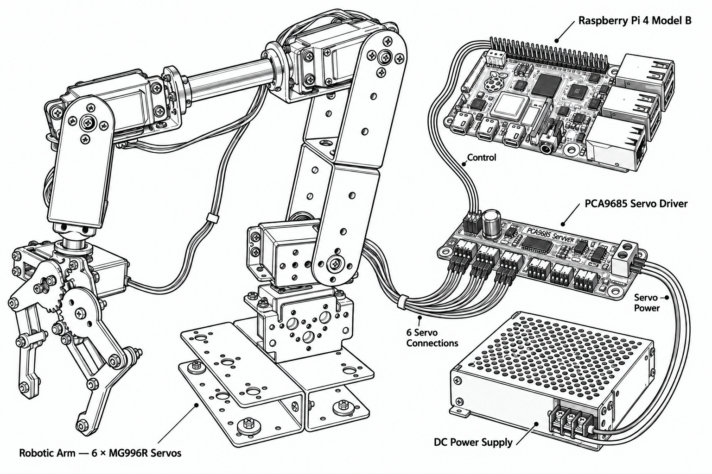
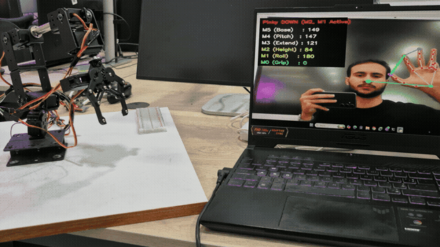
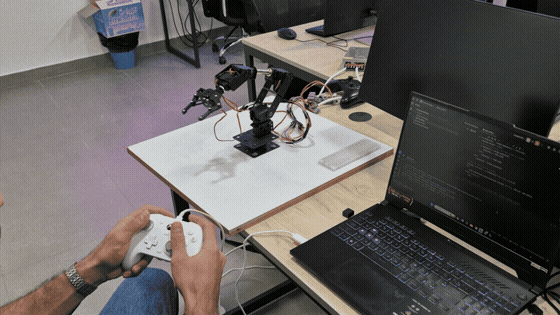
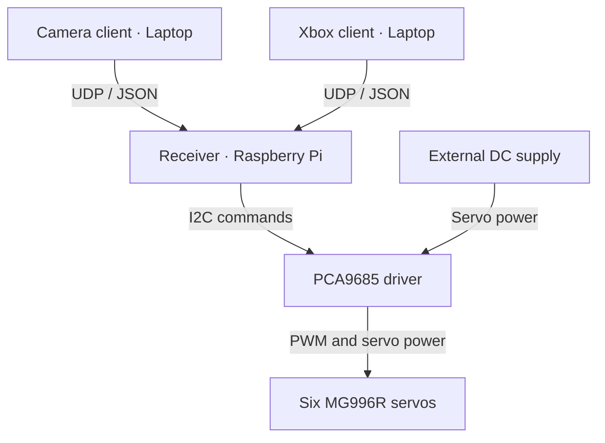
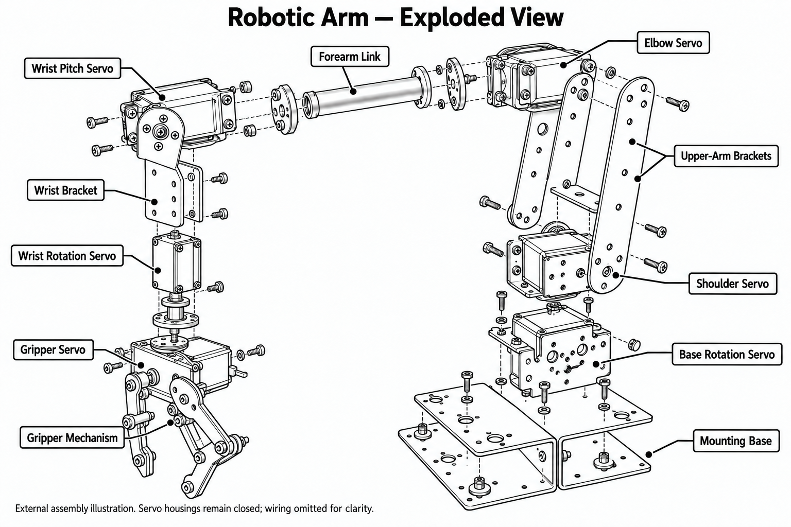
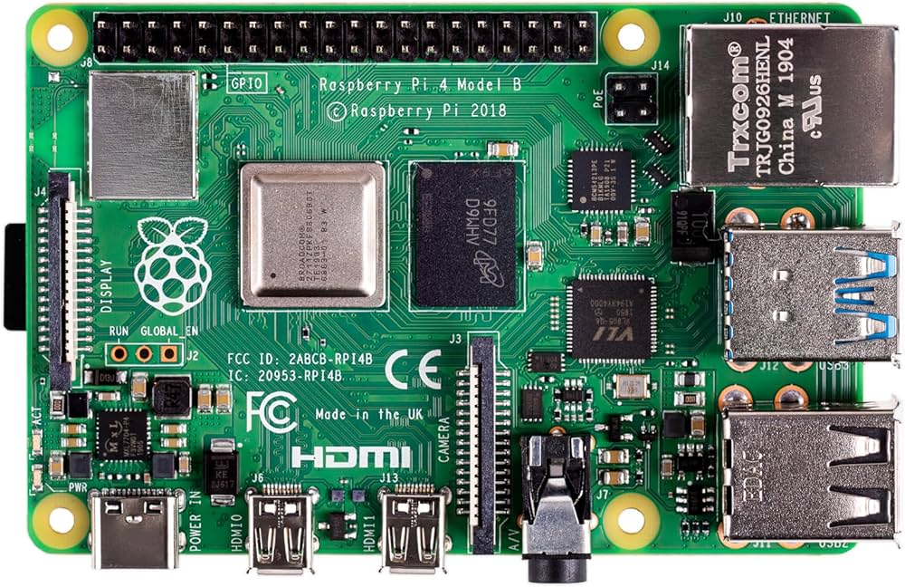
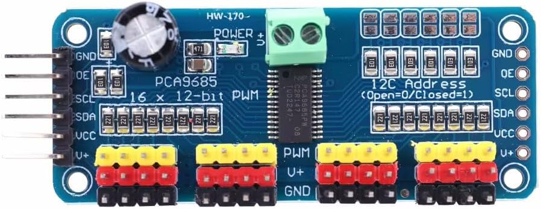
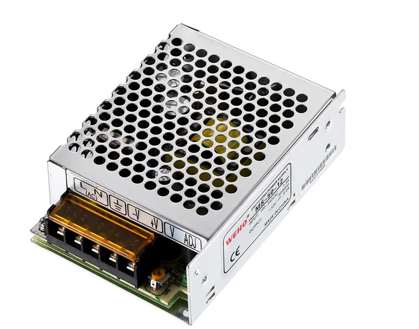
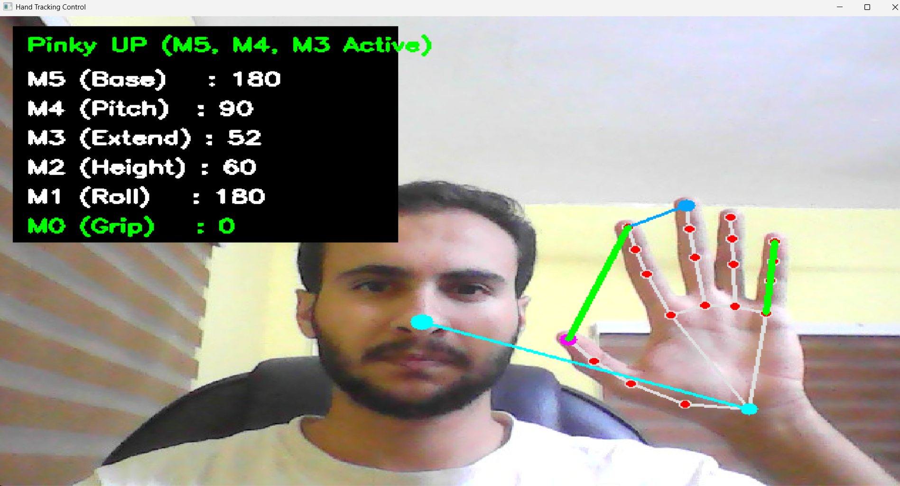
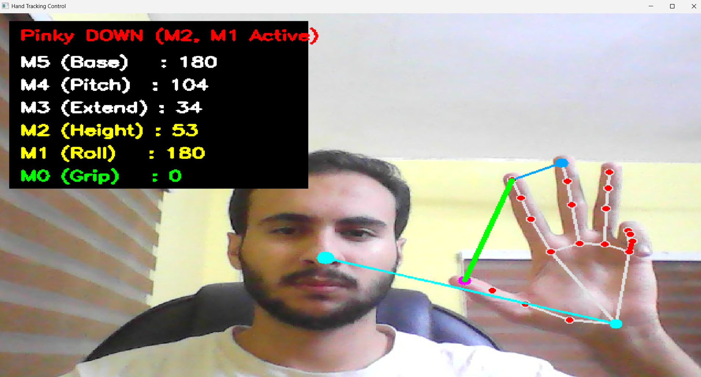

# Wireless Robotic Arm Control

I built this system to control a six-servo robotic arm in two ways: with an Xbox controller or with one hand in front of a webcam. Both methods run on a laptop and send motor commands over Wi-Fi to a Raspberry Pi, which controls the arm through a PCA9685 servo driver.

The system has been assembled, tested, and used on the physical arm. The recordings below show both control methods in operation.



## Contents

- [The arm in action](#the-arm-in-action)
- [System architecture](#how-the-system-is-arranged)
- [Hardware](#hardware)
- [Hand control and the two modes](#controlling-six-motors-with-one-hand)
- [Xbox control mapping](#xbox-control-mapping)
- [Software and setup](#software-and-setup)
- [Mathematical concepts and algorithms](#mathematical-concepts--algorithms)

## The arm in action

### Camera control

The hand-tracking client turns hand movements and finger gestures into motor angles. In this recording, bringing the thumb and index finger together closes the gripper, while moving the hand sideways rotates the wrist when the pinky is bent.



### Xbox control

The controller's sticks and buttons provide direct control of the joints and gripper.



The GIFs show selected excerpts of the arm in operation.

## How the system is arranged

The laptop reads the input, calculates six target angles, and sends them as JSON messages over UDP on port `5005`. The Raspberry Pi receives the angles, limits them to the configured ranges, smooths the changes, and updates the PCA9685 over I²C.

Camera processing runs on the laptop to keep OpenCV and MediaPipe inference off the Raspberry Pi. This leaves the Pi responsible for receiving commands and controlling the servos.

The Xbox controller had previously worked while connected directly to the Raspberry Pi. When setting it up in the lab, the number of nearby Bluetooth devices made finding and pairing the controller difficult. Moving the controller input to the laptop allowed both input methods to use the same Wi-Fi receiver on the Pi.



Only one laptop client runs at a time. UDP carries target angles without delivery acknowledgements; the receiver does not send measured joint positions back to the laptop.

## Hardware

### Robotic arm and MG996R servos

The metal arm uses six MG996R servos: five for joint movement and one for opening and closing the gripper. The receiver uses PCA9685 channels `0` through `5`, matching the software names `M0` through `M5`.



The assembly and system drawings illustrate the components; they are not dimensioned assembly plans or pin-level wiring diagrams.

### Raspberry Pi 4 Model B

The Raspberry Pi runs `rpi_server.py`. It receives the laptop's commands and sends the resulting angles to the servo driver.



### PCA9685 servo driver

The PCA9685 provides the PWM outputs used to command the servos. Six of its channels are connected to the arm, and its servo power input receives power from the external supply.



### External power supply

The DC supply powers the servo rail. The Raspberry Pi uses a separate power input, so the six servos are not powered through the Pi.



The remaining equipment is a laptop, a webcam, an Xbox controller, and a shared Wi-Fi network.

## Controlling six motors with one hand

Finding six separate gestures that were easy to perform with one hand was the main interaction challenge. I used the pinky as a mode switch so that the same sideways and vertical movements could control different joints. Pinching the thumb and index finger controls the gripper in either mode.

The camera feed is mirrored. In the tested setup, the operator uses the right hand, and the client reads the selected hand landmarks together with the nose landmark from MediaPipe Holistic. The displayed motor values and mode label show which joints are responding.

### Mode 1 — Pinky up

With the pinky extended, the hand controls the base and the two main arm joints.



| Gesture | Motor | Movement |
| --- | --- | --- |
| Move the hand left or right | M5 | Base rotation |
| Spread or bring together the index and middle fingers | M4 | Lower-arm pitch |
| Raise or lower the wrist relative to the nose | M3 | Middle-arm movement / extension |

### Mode 2 — Pinky down

With the pinky bent, sideways movement controls wrist rotation, and vertical movement controls the upper joint. This lets the operator reuse familiar movements instead of learning a separate gesture for each motor.



| Gesture | Motor | Movement |
| --- | --- | --- |
| Move the hand left or right | M1 | Wrist / gripper rotation |
| Raise or lower the wrist relative to the nose | M2 | Upper-arm joint / height adjustment |

### Gripper — Active in both modes

Bringing the thumb and index finger together closes `M0`; separating them opens it. This calculation runs before the mode selection, so gripper control remains available whether the pinky is up or down.

When a joint group becomes inactive, its previous target angles are retained. Switching modes does not reset those joints.

## Xbox control mapping

| Input | Pygame mapping | Motor | Movement |
| --- | --- | --- | --- |
| LB / RB | Buttons `4` / `5` | M5 | Base rotation |
| Right stick, vertical | Axis `4` | M4 | Lower-arm pitch |
| Right stick, horizontal | Axis `3` | M3 | Middle-arm movement / extension |
| Left stick, vertical | Axis `1` | M2 | Upper-arm joint / height adjustment |
| Left stick, horizontal | Axis `0` | M1 | Wrist / gripper rotation |
| Configured open / close buttons | Buttons `2` / `0` | M0 | Gripper opening / closing |

The client ignores stick inputs within a `0.2` deadzone. Outside it, stick deflection controls the angle change on each loop iteration. The gripper inputs are read as buttons in this setup; button and axis assignments should match the connected controller.

## Software and setup

### Project files

| File | Runs on | Purpose |
| --- | --- | --- |
| [src/laptop/hand_tracking.py](src/laptop/hand_tracking.py) | Laptop | Processes camera frames and sends target angles |
| [src/laptop/xbox_wifi.py](src/laptop/xbox_wifi.py) | Laptop | Reads controller input and sends target angles |
| [src/raspberry_pi/rpi_server.py](src/raspberry_pi/rpi_server.py) | **Raspberry Pi** | Receives, clamps, smooths, and applies commands |
| `assets/` | Documentation | Hardware photos, control screenshots, and recordings |

Run the receiver on the Raspberry Pi and **one** input client on the laptop. Camera processing takes place entirely on the laptop.

### Install dependencies

Run the commands below from the repository root, using a separate Python environment on each device.

On the **laptop**:

```bash
python -m pip install -r src/laptop/requirements.txt
```

The laptop requirements retain the project's pinned MediaPipe, OpenCV-contrib, and Pygame versions. OpenCV-contrib provides `cv2`; installing a second OpenCV package into the same environment is unnecessary. The camera code uses the MediaPipe `mp.solutions.holistic` API.

On the **Raspberry Pi**:

```bash
python3 -m pip install -r src/raspberry_pi/requirements.txt
```

Enable I²C on the Pi and connect the PCA9685 before starting the receiver. The servo supply, driver, and Pi must share a ground reference. The external supply feeds the servo power rail; the Pi has its own power input. The system diagram shows the architecture rather than pin-level wiring.

### Configure and run

1. Connect the laptop and Raspberry Pi to the same local network.
2. Replace `YOUR_RPI_IP` in the selected laptop client with the Pi's address. Both clients and the receiver use UDP port `5005`; the network must allow this traffic.
3. Start the receiver **on the Raspberry Pi**:

   ```bash
   python3 src/raspberry_pi/rpi_server.py
   ```

4. Start **one client on the laptop**:

   ```bash
   python src/laptop/hand_tracking.py
   ```

   or:

   ```bash
   python src/laptop/xbox_wifi.py
   ```

For camera control, keep the hand and face visible so the hand landmarks and nose reference can be detected. For controller input, connect the controller to the laptop before starting the client.

### Starting and stopping

On startup, the receiver commands `M1`–`M5` to `90°` and `M0` to `45°`.

Pressing `Ctrl+C` in the Xbox client sends a gradual sequence of commands back to those standby angles. This depends on the laptop and Pi remaining connected. Pressing `Q` closes the camera client without a parking sequence.

The camera sends commands only when both the selected hand and pose landmarks are detected. If tracking or communication stops, the receiver retains the last servo commands. The current receiver has no connection-loss timeout or automatic return routine.

## Mathematical Concepts & Algorithms

These calculations are implemented in `hand_tracking.py` and `rpi_server.py`. They convert tracked landmarks into joint targets, then limit and smooth the commands sent to the servos.

### 1. Euclidean distance between landmarks

The camera client's `dist_3d(p1, p2)` function calculates:

$$
d(p_1,p_2)=\sqrt{(x_2-x_1)^2+(y_2-y_1)^2+(z_2-z_1)^2}
$$

It is used for finger spacing, the thumb–index pinch, and detecting a bent pinky. The inputs are MediaPipe's estimated landmark coordinates, including estimated depth. The result is a distance in landmark coordinate space, not a calibrated measurement in centimeters or a guarantee of independence from camera angle. See the [MediaPipe landmark coordinate description](https://chuoling.github.io/mediapipe/solutions/holistic.html#left_hand_landmarks).

To reduce the effect of the hand appearing larger or smaller in the frame, finger distances are divided by a reference distance on the same hand:

$$
r_V=\frac{d(p_8,p_{12})}{d(p_0,p_9)+\varepsilon},
\qquad
r_P=\frac{d(p_4,p_8)}{d(p_0,p_5)+\varepsilon}
$$

Here, $\varepsilon=10^{-5}$ prevents division by zero. The landmarks are the wrist (`0`), thumb tip (`4`), index-finger base (`5`) and tip (`8`), middle-finger base (`9`) and tip (`12`). The ratio $r_V$ controls `M4`, while $r_P$ controls the gripper.

### 2. Linear mapping and clamping

The function `C(v, a, b)` clamps a value to the interval from `a` to `b`:

$$
C(v,a,b)=\max(a,\min(b,v))
$$

Linear mapping converts an input range into an angle range:

$$
\theta=\theta_{\min}+
\frac{r-r_{\min}}{r_{\max}-r_{\min}}
(\theta_{\max}-\theta_{\min})
$$

For the index–middle finger gesture, the code clamps $r_V$ to $[0.1,0.6]$ and maps it to 15°–165°:

$$
\theta_4=15+150\frac{C(r_V,0.1,0.6)-0.1}{0.6-0.1}
$$

For the gripper, the direction is reversed. A smaller thumb–index ratio produces a larger closing angle:

$$
\theta_0=90-90\frac{C(r_P,0.18,0.65)-0.18}{0.65-0.18}
$$

The camera client converts the resulting targets to integers. The Xbox client also clamps its targets, and the receiver applies its own angle limits to incoming commands.

### 3. Hand position and mode selection

Horizontal wrist position controls either `M5` or `M1`, depending on the pinky mode:

$$
\theta_x=C\left(90+450(x_{\mathrm{wrist}}-0.5),0,180\right)
$$

The factor $450=180\times2.5$ comes from `X_SENSITIVITY = 2.5`. It lets a smaller sideways hand movement cover a wider angle range.

Vertical control uses the wrist's position relative to the nose, for either `M3` or `M2`:

$$
\theta_y=C\left(90+200(y_{\mathrm{nose}}-y_{\mathrm{wrist}}),15,170\right)
$$

The receiver then applies the selected motor's own limits. For example, `M3` is capped at 165° even though the camera calculation can reach 170°.

The pinky is treated as bent when:

$$
d(p_0,p_{20})<1.28\,d(p_0,p_{17})
$$

Landmarks `17` and `20` are the pinky base and tip. This comparison selects the active motor group on each tracked frame.

### 4. Exponential smoothing

In `rpi_server.py`, each received target is first clamped and then used to update the commanded angle:

$$
\theta_{k+1}=\theta_k+\alpha(\theta_{\mathrm{target}}-\theta_k)
$$

A smaller $\alpha$ changes the command more gradually; a larger value responds faster. For example, with a current command of 90°, a target of 150°, and $\alpha=0.10$, the next command is 96°.

| Motor | Configured angle range | Smoothing factor (alpha) |
| --- | --- | --- |
| M5 — Base | 0°–180° | 0.15 |
| M4 — Lower arm | 15°–165° | 0.10 |
| M3 — Middle arm | 15°–165° | 0.10 |
| M2 — Upper arm | 10°–170° | 0.10 |
| M1 — Wrist rotation | 0°–180° | 0.20 |
| M0 — Gripper | 0°–90° | 0.35 |

Each update happens when a packet arrives, so the packet rate affects the response over time. The stored angle is the last software command, not a measured joint position. Smoothing softens command changes, while the condition of the servos and mechanical parts still affects physical stability.
